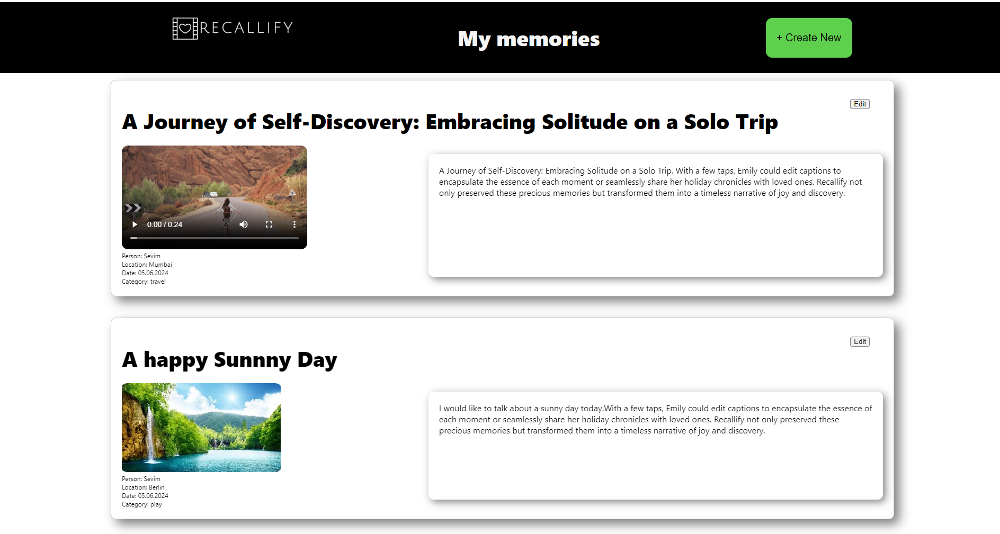
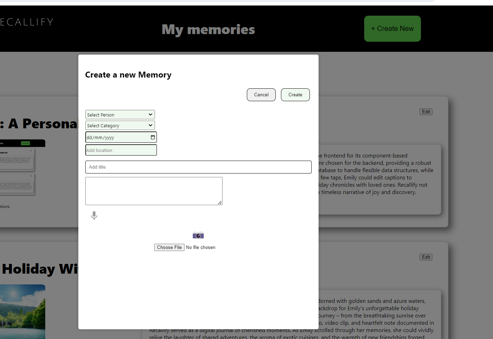
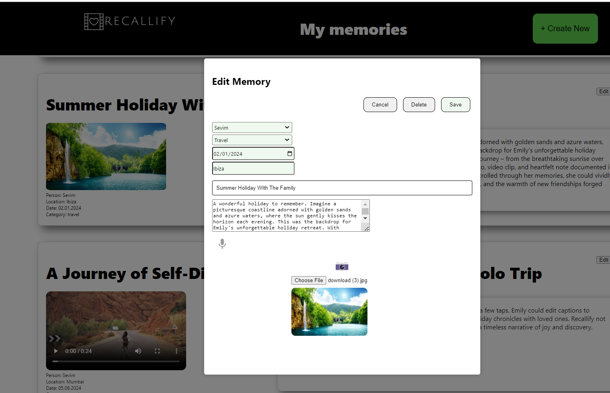

## Recallify - A Personal Memory Recording Web App

**Never Forget Your Most Cherished Memories Again**

Do you ever wish you could hold onto every special moment forever?

Introducing Recallify, the personal memory vault that empowers you to effortlessly capture, preserve, and relive your most treasured experiences.

## Key Features
With Recallify, you can:

Capture Memories in an Instant: Upload videos, photos, or record voice notes directly within the app.

Immerse Yourself in the Past: Relive your memories in a visually stunning format, whether you're browsing photos, playing videos, or revisiting written notes.

Keep Your Memories Evolving: Life changes, and so can your memories. Recallify allows you to edit details, add captions, update descriptions, or even attach additional media to enhance your story.

Curate Your Digital Archive: Recallify empowers you to control your memories. Delete what no longer sparks joy and keep what matters most.
Recallify is more than just a memory storage app; it's a place to build a lasting legacy of your life's most precious moments.


## Screenshots

<p align="center">
  
  
	
</p>

## Tech Stack
The main technologies, frameworks, and libraries used in the project:
- Frontend:
	- React
	- Axios
	- Firebase
	- Vanilla CSS
	- Web Speech API
	- React-webcam

- Backend:
  - Node.js
  - Express
  - MongoDB
  - Mongoose 

## Getting started

### Prerequisites
- Node
- Git
- npm 
- MongoDB
- [Firebase Storage](https://firebase.google.com/) to obtain the API Key credentials

### Installation

1. Clone the repo

```
git clone https://github.com/sevtechcodes/Recallify.git
```

2. Install dependencies
```
cd Recallify
npm install
```

3. To start server
```
cd server
npm install
npm start
```


3. To run client
```
cd client
npm install
npm run dev
```

## Developer
* Sevim Tas Joseph [GitHub](https://github.com/sevtechcodes)
* [LinkedIn](https://www.linkedin.com/in/sevimjoseph)