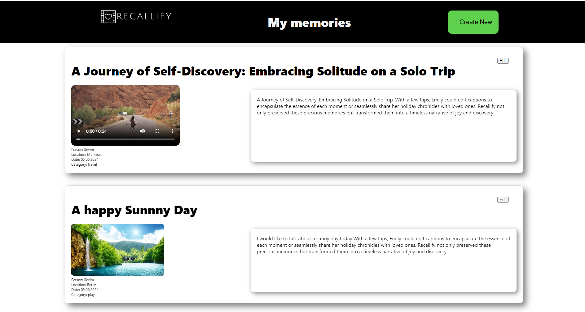
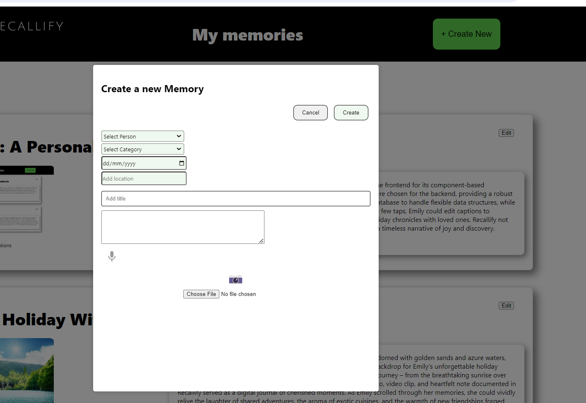
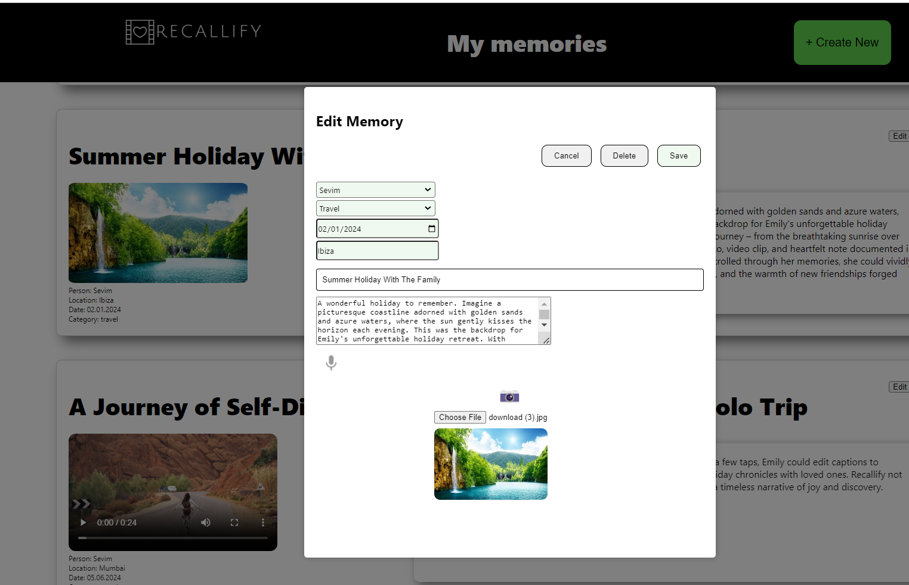

## Recallify
**A Personal Memory Recording Web App**

Recallify is a platform designed to improve memory recall. It serves as a personal memory recording web application where users can preserve videos, voice recordings, images, and notes. The primary aim is to immortalize cherished moments for future recollection.

## Repository
https://github.com/sevtechcodes/Recallify.git

## MVP - Key Features
**With Recallify, users can create, read, edit, and delete memories effortlessly:**

**Create Memory:** Users could easily capture new memories by uploading videos, pictures, or recording voice notes directly within the app.

**Read Memory:** Each memory was presented in a visually appealing format, allowing users to revisit their captured moments with ease. Whether browsing through a photo, playing back a video, or reading through notes.

**Edit Memory:** Recognizing the impermanence of memory, Recallify is designed to be flexible. Users could edit details of their memories – adding captions, updating descriptions, or even attaching additional media to enrich the story.

**Delete Memory:** Recallify allowed users to delete memories they no longer wished to keep, ensuring they could curate their digital archive according to their preferences.


## Technologies Used
List the main technologies, frameworks, and libraries used in the project:
- Frontend:
	- React
	- Axios
	- Firebase
	- Vanilla CSS
	- Web Speech API
	- React-webcam

- Backend:
  - Node.js
  - Express
  - Mongoose 

**Data Sources**
	-Local storage
	-Firebase storage for media

## Getting Started

## Prerequisites
- Node.js
- npm 
- MongoDB
- Firebase storage credentials

### Installation

1. **Clone the repository:**

   ```bash 
	 git clone https://github.com/sevtechcodes/Recallify.git

1. **Install dependencies:**
-cd Recallify


-cd server
-npm install
-npm start

-cd client
-npm install
-npm run dev





